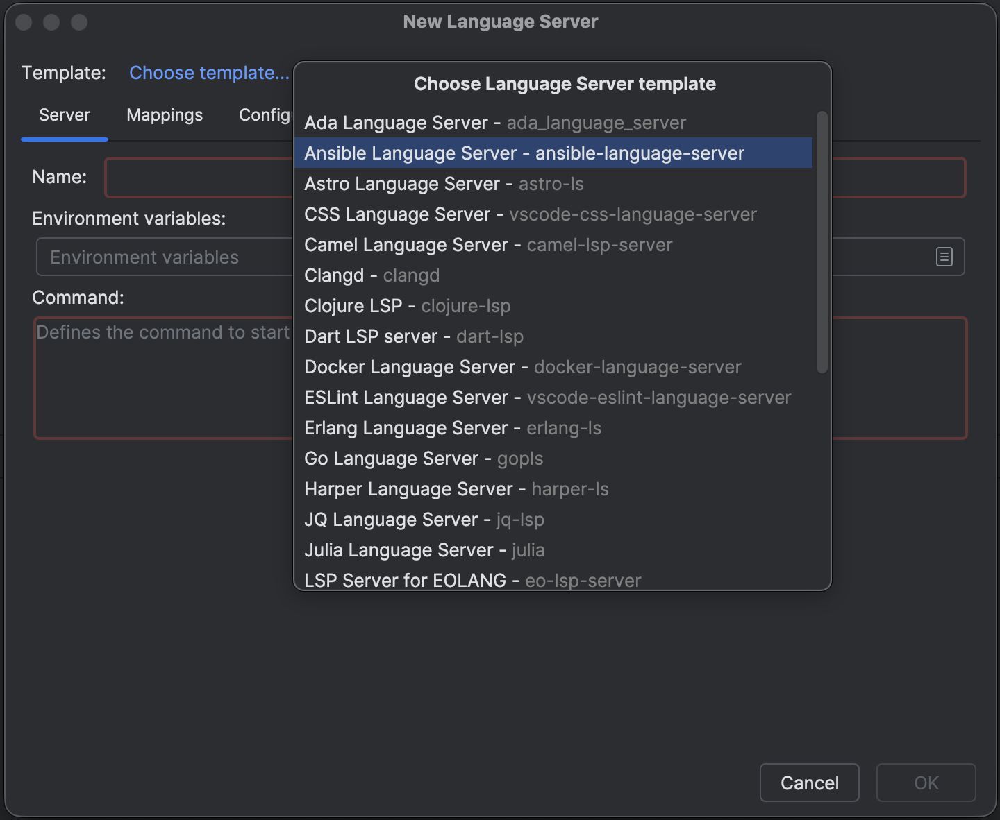

# Ansible Language Server

## Install the language server
1. Ensure `npm`, a NodeJS package manager,  is installed on your system: https://docs.npmjs.com/downloading-and-installing-node-js-and-npm
2. Create a new language server connection. Choose "Ansible Language Server" from templates dropdown.
   